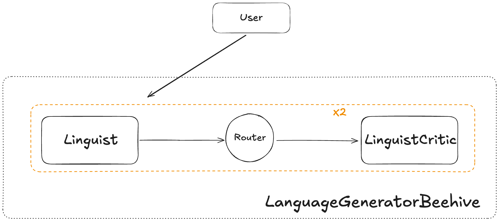

# Getting started

## Installation

You can install Beehive with `pip`:
```bash
pip install beehive
```

Note that the standard Beehive installation includes the OpenAI client and a few Langchain packages.

## Setting up your first Beehive

Here's a simple Beehive that instructions two agents to work together to create a new language:

```python
linguist_agent = BeehiveAgent(
    name="Linguist",
    backstory="You are an expert in linguistics. You work alongside another linguist to develop new languages."
    model=OpenAIModel(
        model="gpt-4-turbo",
    ),
)

linguist_critic = BeehiveAgent(
    name="LinguistCritic",
    backstory="You are an expert in linguistics. Specifically, you are great at examining grammatical rules of new languages and suggesting improvements.",
    model=OpenAIModel(
        model="gpt-4-turbo",
    ),
)

beehive = Beehive(
    name="LanguageGeneratorBeehive",
    backstory="You are an expert in creating new languages.",
    model=OpenAIModel(
        model="gpt-4-turbo",
    ),
    execution_process=FixedExecution(route=(linguist_agent >> linguist_critic)),
    chat_loop=2,
    enable_questioning=True,
)
beehive.invoke(
    "Develop a new language using shapes and symbols. After you have developed a comprehensive set of grammar rules, provide some examples of sentences and their representation in the new language.",
    pass_back_model_errors=True
)
```

Here is the output of that invokation:

??? example "LanguageGeneratorBeehive `stdout`"
    ```
    ------------------------------------------------------------------------------------------------------------------------
    LanguageGeneratorBeehive / Linguist

    As an expert in linguistics with a focus on developing new languages, create a language using shapes and symbols. Define
    a comprehensive set of grammar rules for this language. Then, provide examples of sentences in English alongside their
    representations in the newly created symbolic language.

    Creating a language based on shapes and symbols involves defining a set of visual elements that can represent phonetic
    sounds, grammatical structures, and semantic meanings. For this exercise, let's create a basic symbolic language called
    "Forma."

    ### Basic Elements of Forma
    1. **Shapes**: Circles, triangles, squares, and lines.
    2. **Colors**: Red, blue, green, and black.
    3. **Size**: Large and small.
    4. **Position**: Overlapping, adjacent, inside.

    ### Phonetics
    - **Circles** represent vowels.
    - **Triangles** represent consonants.
    - **Squares** represent modifiers (like tense or plurality).
    - **Lines** are connectors or relational symbols (like prepositions).

    ### Colors and Sizes
    - **Red**: Past tense or negative.
    - **Blue**: Present tense or question.
    - **Green**: Future tense or emphasis.
    - **Black**: Neutral or statement.
    - **Large shapes**: Emphasis or formal tone.
    - **Small shapes**: Common speech or informal tone.

    ### Positional Grammar
    - **Overlapping shapes**: Compound words or linked ideas.
    - **Adjacent shapes**: Separate words or ideas.
    - **Shapes inside others**: Dependent clauses or possession.

    ### Example Grammar Rules
    1. **Sentence Structure**: Subject (triangle) + Verb (circle) + Object (triangle) + Modifier (square). Modifiers follow
    the word they modify.
    2. **Questions**: Blue circle at the start of the sentence.
    3. **Negation**: A small red triangle before the verb.
    4. **Tense**: Color of the square after the verb indicates tense (red for past, blue for present, green for future).

    ### Example Sentences
    1. **English**: "I eat apples."
    - **Forma**: 🔺 (I) 🔵⚪ (eat, present) 🔺 (apples)

    2. **English**: "Did you see the dog?"
    - **Forma**: 🔵⚪ (question) 🔺 (you) 🔵⚪ (see, past) 🔺 (the dog)

    3. **English**: "She will not go to the park."
    - **Forma**: 🔺 (she) 🟢⚪ (will go, future) 🔴🔺 (not) ➖ 🔺 (to) 🔺 (the park)

    4. **English**: "They are reading a book."
    - **Forma**: 🔺 (they) 🔵⚪ (are reading, present) 🔺 (a book)

    5. **English**: "Can I have some water?"
    - **Forma**: 🔵⚪ (question) 🔺 (I) 🔵⚪ (have, present) 🔺 (some water)

    ### Complex Sentence
    - **English**: "The quick brown fox jumps over the lazy dog."
    - **Forma**: 🔺 (The quick brown fox) 🔵⚪ (jumps, present) ➖ 🔺 (over) 🔺 (the lazy dog)

    This symbolic language, Forma, uses visual elements to convey meaning, which can be expanded with more complex rules and
    additional symbols for more nuanced expressions. The examples provided are basic and intended to illustrate the
    foundational structure of the language.
    ------------------------------------------------------------------------------------------------------------------------
    LanguageGeneratorBeehive / Router

    Sending conversation to LinguistCritic next!
    ------------------------------------------------------------------------------------------------------------------------
    LanguageGeneratorBeehive / LinguistCritic

    Based on the foundational structure of the symbolic language 'Forma' previously outlined, please refine and expand the
    grammar rules to include more complex sentence structures and additional modifiers. Also, develop a more nuanced system
    for expressing emotions and interrogative forms using the existing shapes and colors. Provide updated examples of
    complex sentences and their representations in 'Forma'.

    To refine and expand the grammar rules of the symbolic language 'Forma', and to include more complex sentence structures
    and additional modifiers, as well as a nuanced system for expressing emotions and interrogative forms, we can proceed as
    follows:

    ### Expanded Grammar Rules for Complex Sentence Structures

    1. **Compound Sentences**: Use a double line (⎯⎯) to connect two independent clauses. Each clause follows the basic
    sentence structure but is considered part of a larger sentence.

    2. **Subordinate Clauses**: Introduce a smaller square inside the main square to indicate a subordinate clause, which
    provides additional information about the main clause.

    3. **Passive Voice**: Use a reversed triangle (▽) to indicate the passive voice. The object of the action comes before
    the verb, followed by the reversed triangle and then the subject.

    ### Additional Modifiers

    1. **Adverbs**: Introduce hexagons to represent adverbs. Place the hexagon adjacent to the verb it modifies. The color
    indicates the type of adverb:
    - **Red**: Negative adverb.
    - **Blue**: Manner adverb.
    - **Green**: Time adverb.

    2. **Comparatives and Superlatives**: Use stacked triangles for comparatives (two triangles) and superlatives (three
    triangles). The size of the triangles indicates the degree of comparison.

    ### Expressing Emotions

    1. **Emotional Tone**: Introduce a border around the sentence. The style of the border indicates the emotion:
    - **Dotted line**: Uncertainty or confusion.
    - **Wavy line**: Excitement or happiness.
    - **Jagged line**: Anger or frustration.

    ### Nuanced Interrogative Forms

    1. **Yes/No Questions**: A blue circle at the start of the sentence.
    2. **Wh-Questions**: A blue square at the start of the sentence, with small symbols inside to indicate the type of
    question (who, what, where, etc.).

    ### Updated Example Sentences

    1. **English**: "The cat, which was hungry, ate the food."
    - **Forma**: 🔺 (The cat) 🔲🔺 (which was hungry) 🔵⚪ (ate, past) 🔺 (the food)

    2. **English**: "Did you quickly run to the store?"
    - **Forma**: 🔵⚪ (question) 🔺 (you) 🔵⬡ (quickly) 🔵⚪ (run, past) ➖ 🔺 (to the store)

    3. **English**: "She has not been seen by anyone."
    - **Forma**: 🔺 (She) 🔴⬡ (not) 🔵⚪ (been seen, past) ▽ 🔺 (by anyone)

    4. **English**: "I am very happy to meet you."
    - **Forma**: 🔺 (I) 🔵⚪ (am, present) 🔵🔺🔺 (very) 🌊 (happy) ➖ 🔺 (to meet) 🔺 (you)

    These expansions and refinements in the grammar and symbolic representations of 'Forma' allow for more detailed and
    expressive communication, accommodating complex sentence structures, additional modifiers, emotional expressions, and
    nuanced interrogative forms.
    ------------------------------------------------------------------------------------------------------------------------
    LanguageGeneratorBeehive / Linguist

    Refine and expand the grammar rules of the symbolic language 'Forma' to include more complex sentence structures and
    additional modifiers. Develop a nuanced system for expressing emotions and interrogative forms using the existing shapes
    and colors. Provide updated examples of complex sentences and their representations in 'Forma'. Ensure that the
    modifications are coherent with the foundational structure previously established.

    To refine and expand the grammar rules of the symbolic language 'Forma', and to include more complex sentence structures
    and additional modifiers, as well as a nuanced system for expressing emotions and interrogative forms, we can proceed as
    follows:

    ### Expanded Grammar Rules for Complex Sentence Structures

    1. **Compound Sentences**: Use a double line (⎯⎯) to connect two independent clauses. Each clause follows the basic
    sentence structure but is considered part of a larger sentence.

    2. **Subordinate Clauses**: Introduce a smaller square inside the main square to indicate a subordinate clause, which
    provides additional information about the main clause.

    3. **Passive Voice**: Use a reversed triangle (▽) to indicate the passive voice. The object of the action comes before
    the verb, followed by the reversed triangle and then the subject.

    ### Additional Modifiers

    1. **Adverbs**: Introduce hexagons to represent adverbs. Place the hexagon adjacent to the verb it modifies. The color
    indicates the type of adverb:
    - **Red**: Negative adverb.
    - **Blue**: Manner adverb.
    - **Green**: Time adverb.

    2. **Comparatives and Superlatives**: Use stacked triangles for comparatives (two triangles) and superlatives (three
    triangles). The size of the triangles indicates the degree of comparison.

    ### Expressing Emotions

    1. **Emotional Tone**: Introduce a border around the sentence. The style of the border indicates the emotion:
    - **Dotted line**: Uncertainty or confusion.
    - **Wavy line**: Excitement or happiness.
    - **Jagged line**: Anger or frustration.

    ### Nuanced Interrogative Forms

    1. **Yes/No Questions**: A blue circle at the start of the sentence.
    2. **Wh-Questions**: A blue square at the start of the sentence, with small symbols inside to indicate the type of
    question (who, what, where, etc.).

    ### Updated Example Sentences

    1. **English**: "The cat, which was hungry, ate the food."
    - **Forma**: 🔺 (The cat) 🔲🔺 (which was hungry) 🔴⚪ (ate, past) 🔺 (the food)

    2. **English**: "Did you quickly run to the store?"
    - **Forma**: 🔵⚪ (question) 🔺 (you) 🔵⬡ (quickly) 🔵⚪ (run, past) ➖ 🔺 (to the store)

    3. **English**: "She has not been seen by anyone."
    - **Forma**: 🔺 (She) 🔴⬡ (not) 🔴⚪ (been seen, past) ▽ 🔺 (by anyone)

    4. **English**: "I am very happy to meet you."
    - **Forma**: 🔺 (I) 🔵⚪ (am, present) 🔵🔺🔺 (very) 🌊 (happy) ➖ 🔺 (to meet) 🔺 (you)

    These expansions and refinements in the grammar and symbolic representations of 'Forma' allow for more detailed and
    expressive communication, accommodating complex sentence structures, additional modifiers, emotional expressions, and
    nuanced interrogative forms.
    ------------------------------------------------------------------------------------------------------------------------
    LanguageGeneratorBeehive / Router

    Sending conversation to LinguistCritic next!
    ------------------------------------------------------------------------------------------------------------------------
    LanguageGeneratorBeehive / LinguistCritic

    Based on the foundational structure and recent expansions of the symbolic language 'Forma', further refine the grammar
    rules to include additional complex sentence structures and modifiers. Develop a more detailed system for expressing
    emotions and interrogative forms using the existing shapes and colors. Provide updated examples of complex sentences and
    their representations in 'Forma'. Ensure that the modifications are coherent with the foundational structure previously
    established and align with the principles of linguistic development.

    To further refine the grammar rules of the symbolic language 'Forma' and develop a more detailed system for expressing
    emotions and interrogative forms, we can introduce the following enhancements:

    ### Additional Complex Sentence Structures

    1. **Conditional Sentences**: Use a dashed line ( - - - ) to connect the conditional clause to the main clause. The
    conditional clause starts with a pentagon to indicate the conditional mood.

    2. **Causative Constructions**: Introduce a small circle within a triangle to indicate that the action is caused by the
    subject but performed by another. This structure emphasizes the initiator of the action rather than the performer.

    3. **Relative Clauses**: Use a semi-transparent overlay on the shape representing the noun that the relative clause
    modifies. This visually connects the clause to the noun.

    ### Enhanced Modifiers

    1. **Frequency Adverbs**: Introduce ellipses to represent frequency (often, sometimes, rarely). The number of dots
    within the ellipse indicates the frequency (more dots for higher frequency).

    2. **Degree Modifiers**: Use concentric shapes to indicate the degree of intensity (very, quite, slightly). The number
    of concentric layers corresponds to the degree of intensity.

    ### Detailed System for Expressing Emotions

    1. **Specific Emotions**: Introduce specific patterns within the borders to represent different emotions:
    - **Stripes**: Confusion or mixed feelings.
    - **Spirals**: Surprise or shock.
    - **Stars**: Joy or excitement.

    2. **Intensity of Emotions**: The thickness of the border indicates the intensity of the emotion. Thicker borders
    represent stronger emotions.

    ### Nuanced Interrogative Forms

    1. **Option Questions**: Use a series of small blue triangles to indicate choices in a question (e.g., "Would you like
    tea or coffee?").

    2. **Explanatory Questions**: Introduce a blue hexagon at the start of the sentence to indicate a request for
    explanation (e.g., "Why is this happening?").

    ### Updated Example Sentences

    1. **English**: "If it rains, the picnic will be canceled."
    - **Forma**: ⬟ (if) 🔵⚪ (rains, present) - - - 🔺 (the picnic) 🔵🔲 (will be, future) 🔵⚪ (canceled, passive)

    2. **English**: "She makes him do his homework."
    - **Forma**: 🔺 (She) 🔵⚪ (makes, present) 🔺⚪ (him) 🔵⚪ (do, present) 🔺 (his homework)

    3. **English**: "The book that I read was interesting."
    - **Forma**: 🔺 (The book) ⬛🔺 (that I read) 🔵⚪ (was, past) 🔵🌟 (interesting)

    4. **English**: "How often do you go to the gym?"
    - **Forma**: 🔵⬡ (how often) 🔵⚪ (do, present) 🔺 (you) 🔵⚪ (go, present) 🔺 (to the gym)

    These further refinements and expansions in the grammar and symbolic representations of 'Forma' enhance the language's
    ability to convey complex ideas, nuanced emotions, and detailed interrogative forms, maintaining coherence with the
    foundational structure and principles of linguistic development.
    ------------------------------------------------------------------------------------------------------------------------
    ```

In this Beehive, we have two invokables that work together to create a new language. The `Linguist` is responsible for creating the initial grammatical rules, and the `LinguistCritic` is responsible for suggesting improvements to those rules. The Beehive is only able to follow a strict [path](/beehive-ai/core_concepts/beehives/#fixedexecution): the `Linguist` is invoked first, followed by the `LinguistCritic`. Internally, we enable these agents to collaborate and build off of another other by passing each other their [`state`](/beehive-ai/core_concepts/memory/#short-term-memory) prior to the other's invokation. Moreover, we wrap our execution in a loop of length 2 (via [`chat_loop`](/beehive-ai/core_concepts/invokables/#base-attributes)) in order to force these invokables to have a lengthier conversation.

{ align=left }

We'll cover each of these concepts next.
