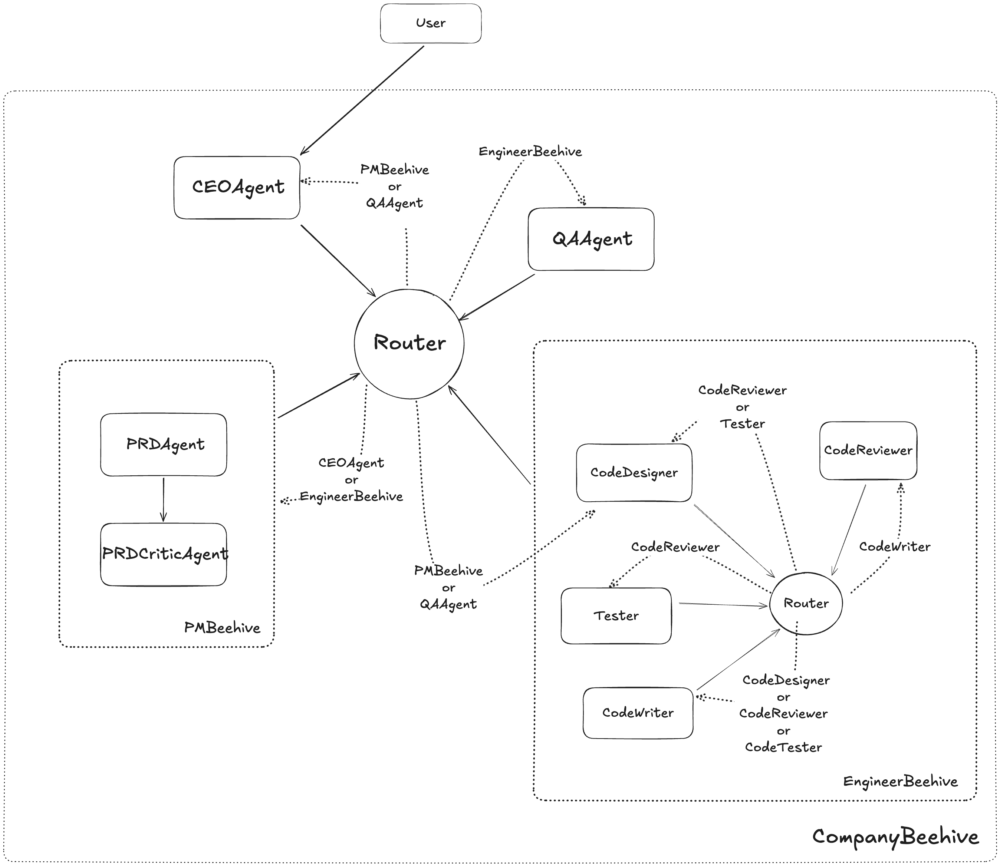

# Beehive

Beehive is an open-source framework for building AI agents and enabling these agents to cooperate with one another to solve tasks. This project was heavily inspired by the awesome work at Langgraph, CrewAI, and PyAutogen.

We're still in the early stages, so any and all feedback is welcome! If you notice a bug or want to suggest an improvement, please open a Github PR.

## Changelog

N/A — this is Beehive's first release!

## Why use Beehive?

In traditional software applications, the chain of actions taken by the application in response to user input is hardcoded. Any "reasoning" that these applications employ (e.g., if the user does "X", do "Y", otherwise do "Z") can be traced to a few lines of code.

On the other hand, agents rely on a language model to decide which actions to take and in what order. Unlike traditional software applications, where the sequence of actions is predefined in the code, the language model itself is the decision-making engine.

Beehive, in particular, is great for rapidly creating complex chat patterns between agents (or [invokables](/beehive-ai/core_concepts/invokables/), in Beehive nomenclature). This includes:

- Sequential chats
- Hierarchical chats
- Multi-agent collaboration / debates
- Nested patterns

In addition, Beehive shares many features with other popular agentic frameworks:

- Role-based agent design
- Loops and conditionals between agents
- State management
- Streaming support
- Memory / feedback

Here is an example of something you could create in Beehive with relatively little code:

{ align=left }

To learn how, head over to [Getting Started](/beehive-ai/getting_started) to install Beehive.
